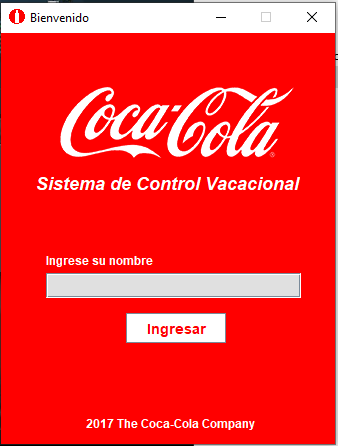
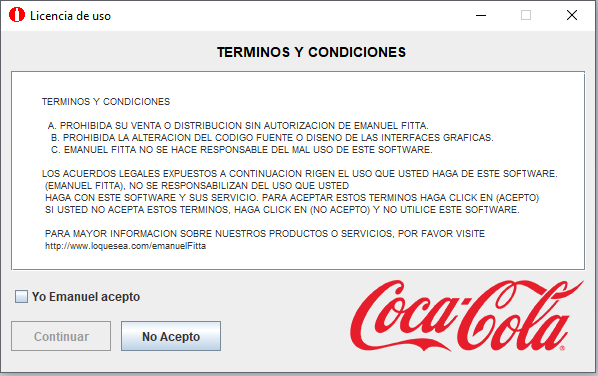
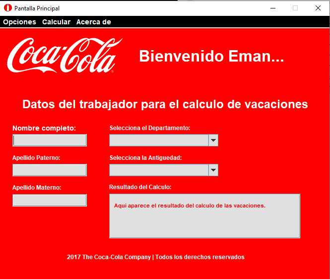

# Proyecto-java-calculadora-Vacaciones

Es un proyecto creado en Java con la libreria swing. 

Se pide un usuario, si no se ingresa nada arroja una ventana pidiendo no dejar el campo en blanco

Al ingresar correctamente se abre una ventana pidiendo al usuario aceptar terminos y condiciones de no hacerlo, regresará a la ventana de bienvenida.

Al aceptar se activa el boton continuar que al presionar abre laventana donde se pide llenar todos los datos. Esta ventana tiene tres menús el primero contiene un submenú donde se puede cambiar el color de fondo,
regresar a la pantalla de bienvenida, se puede limpiar el formulario actual. En el tercer menu, se puede ver la informacion sobre el creador del software. Mientras que en el segundo menu, 
al presionar en calcular > vacaciones, hay dos opciones, si el formulario esta completamente lleno, se arrojara la informacion sobre las vacaciones de acuerdo a las especificaciones
agregadas en el archivo "Requerimientos Coca-cola". De lo contrario se abrira una ventana de alerta pidiendo llenar correctamente el formulario.

.

Por último, se creo el archivo .jar cuyas instrucciones de creacion estan en el archivo "InstructionsEject.txt"

